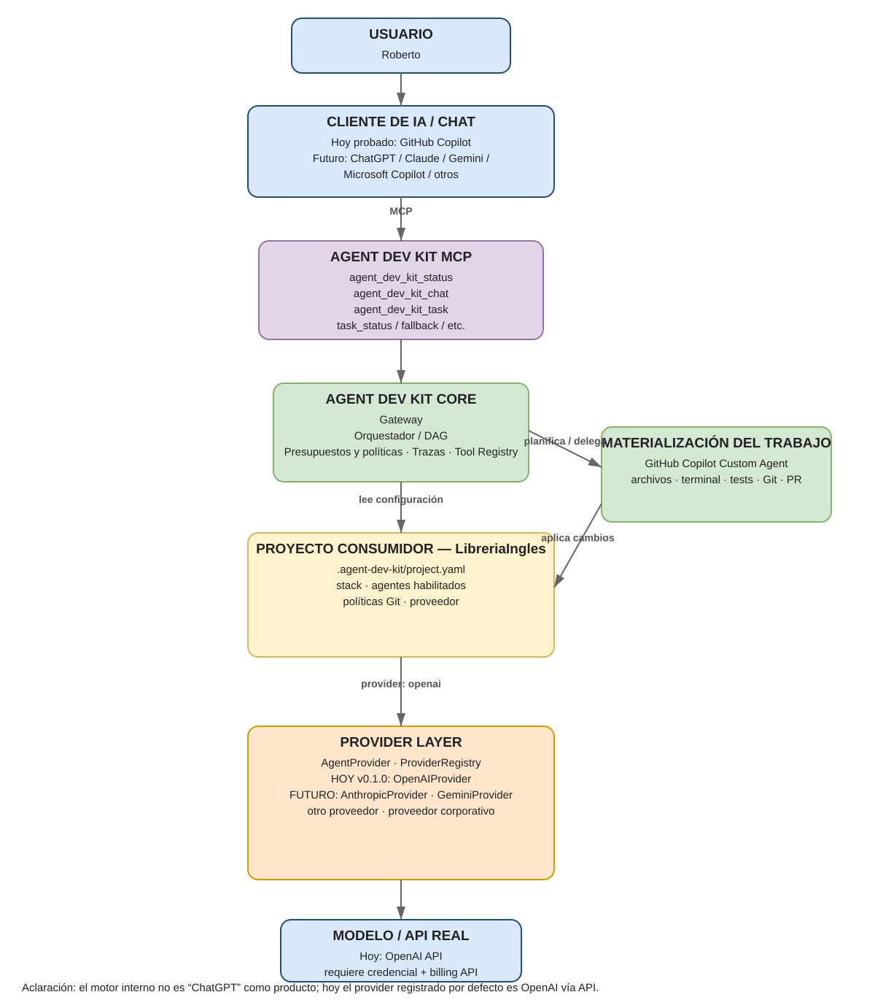

# agent-dev-kit

Framework reutilizable de agentes especializados para acompañar el desarrollo de aplicaciones.

## Estado

El framework tiene un catálogo base de 16 agentes, configuración contextual por proyecto, selección de agentes habilitados, runtime persistente, orquestación por riesgo, abstracción de proveedor, MCP y capa neutral de herramientas.

Versión actual: `v0.2.0`, con tres proveedores (Anthropic, Gemini y OpenAI) y elección de proveedor, modelo y key en cada ejecución por consola. Ver [CHANGELOG](CHANGELOG.md).

## Principios

- Los agentes representan **responsabilidades**, no tecnologías.
- El proyecto consumidor define stack, reglas locales, agentes habilitados y proveedor.
- Los agentes no habilitados no se instancian ni reciben handoffs.
- Triage enruta; no debe intervenir en cada turno si ya existe un especialista activo.
- El framework no queda acoplado a OpenAI: el proveedor concreto vive detrás de un adaptador.
- Las decisiones duraderas deben quedar en código, configuración, tests o documentación del proyecto.

## Arquitectura general

El flujo general separa el cliente de IA/chat, la interfaz MCP, el núcleo de Agent Dev Kit, la configuración del proyecto consumidor y la capa de proveedor.



El diagrama editable está disponible en [`docs/arquitectura_agent_dev_kit.drawio`](docs/arquitectura_agent_dev_kit.drawio).

Desde `v0.2.0` vienen registrados de fábrica `AnthropicProvider`, `GeminiProvider` y `OpenAIProvider`. Los clientes de chat —por ejemplo GitHub Copilot— son independientes del proveedor interno usado por Agent Dev Kit.

## Catálogo base

```text
Agent Product
Agent PMO
Agent Architecture
Agent UX/UI
Agent Backend
Agent Frontend
Agent Database
Agent Security
Agent Testing
Agent Reviewer
Agent Documentation
Agent Triage
Agent DevOps
Agent Performance
Agent Observability
Agent Data
```

## Estructura principal

```text
agent-dev-kit/
├── .github/
│   └── workflows/
│       └── ci.yml
├── docs/
│   ├── agentes/
│   │   └── agent_*.md
│   ├── auditoria_roles_sdlc.md
│   ├── distribucion_cerrada.md
│   ├── distribucion_versionado.md
│   ├── git_workflow.md
│   ├── integracion_copilot.md
│   ├── interfaz_mcp.md
│   ├── orquestacion_multiagente.md
│   ├── orquestacion_por_riesgo.md
│   └── ...
├── examples/
│   └── libreria_ingles/
│       └── .agent-dev-kit/
├── src/
│   └── agent_dev_kit/
│       ├── agents/
│       │   └── agent_*.py
│       ├── providers/
│       │   ├── provider_base.py
│       │   └── provider_openai.py
│       ├── agent_catalog.py
│       ├── agent_definition.py
│       ├── cli.py
│       ├── execution.py
│       ├── gateway.py
│       ├── gateway_config.py
│       ├── git_mutation.py
│       ├── git_policy.py
│       ├── mcp_server.py
│       ├── orchestration.py
│       ├── orchestration_budget.py
│       ├── orchestration_policy.py
│       ├── planner_contract.py
│       ├── preferences.py
│       ├── project_config.py
│       ├── provider_config.py
│       ├── provider_errors.py
│       ├── provider_registry.py
│       ├── routing.py
│       ├── runtime.py
│       ├── task_plan.py
│       └── tooling.py
├── tests/
├── CHANGELOG.md
└── pyproject.toml
```

## Configuración del proyecto consumidor

Agent Dev Kit no se copia dentro del proyecto consumidor.

El consumidor mantiene su propia configuración:

```text
MiProyecto/
└── .agent-dev-kit/
    ├── project.yaml
    └── agents/
        ├── pmo.yaml
        ├── architecture.yaml
        └── ...
```

Ejemplo:

```yaml
project:
  name: LibreriaIngles

stack:
  backend:
    language: Python
    framework: FastAPI
  frontend:
    framework: Angular
  ui:
    framework: Bootstrap
  database:
    engine: SQLite

provider:
  name: openai

git_workflow:
  branches:
    production: main
    integration: develop

gateway:
  session_ttl_seconds: 3600
  max_sessions: 100

orchestration:
  trace:
    enabled: true
    persist_full_request: false
  budgets:
    max_dag_nodes: 12
    max_provider_calls: 24
    max_revisits: 2
    max_context_chars: 16000
    max_dependency_evidence_chars: 8000
  policies:
    - id: auth_requires_review
      when:
        any_risk_flags:
          - auth_change
      require_agents:
        - reviewer

agents:
  enabled:
    - pmo
    - architecture
    - backend
    - frontend
    - testing
    - triage
```

## Documentación

- [Catálogo de agentes](docs/catalogo_agentes.md)
- [Auditoría de responsabilidades SDLC](docs/auditoria_roles_sdlc.md)
- [Configuración nativa y contextual](docs/configuracion_nativa_y_contextual.md)
- [Activación de agentes](docs/activacion_agentes.md)
- [Contexto del proyecto](docs/contexto_proyecto.md)
- [Herramientas por agente](docs/herramientas_agentes.md)
- [Coordinación multi-especialista](docs/orquestacion_multiagente.md)
- [Orquestación por riesgo y subgrafo mínimo](docs/orquestacion_por_riesgo.md)
- [Preferencias persistentes del usuario](docs/preferencias_usuario.md)
- [Ejecución, proveedores y fallback](docs/ejecucion_y_fallback.md)
- [Smoke test pre-versionado](docs/smoke_test.md)
- [Interfaz MCP para clientes de chat](docs/interfaz_mcp.md)
- [Integración con GitHub Copilot](docs/integracion_copilot.md)
- [Distribución y versionado](docs/distribucion_versionado.md)
- [Decisión de distribución cerrada](docs/distribucion_cerrada.md)
- [Política Git por proyecto](docs/git_workflow.md)
- [Proveedores](docs/proveedores.md)
- [Documentación individual de agentes](docs/agentes/)

## Proveedor

Proveedores incluidos: **Anthropic**, **Gemini** y **OpenAI**, cada uno detrás de su adaptador (`AnthropicProvider` y `GeminiProvider` con sus librerías oficiales; `OpenAIProvider` con OpenAI Agents SDK).

Por consola se elige proveedor, modelo y key en cada ejecución; la key no se guarda. `provider.name` de `project.yaml` es el proveedor preferido. Detalle en [Proveedores](docs/proveedores.md).

Otros proveedores pueden agregarse sin reescribir los agentes del catálogo.

La API Python es la interfaz programática principal del framework. El CLI y las integraciones de host pueden evolucionar; durante la serie 0.x cualquier cambio incompatible debe quedar documentado según SemVer.

## Desarrollo

Instalación para desarrollo:

```bash
pip install -e ".[dev]"
```

Proveedores opcionales:

```bash
pip install -e ".[openai,anthropic,gemini]"
```

Tests:

```bash
pytest
```

El CI de release valida tres superficies independientes:

- `Agent Dev Kit CI / test`;
- `Agent Dev Kit CI / openai-provider`;
- `Agent Dev Kit CI / package-smoke`.

Las modernizaciones del framework se gestionan mediante GitHub Issues con códigos `M-xxx`.


## Ejecución

Conversación interactiva:

```bash
agent-dev-kit run .
```

Tarea multi-especialista:

```bash
agent-dev-kit task . "descripción de la tarea"
```

Antes de empezar, un menú pregunta proveedor, key (oculta, no se guarda) y modelo (lista en vivo del proveedor). Con `--provider` y `--model` se saltea el menú.


## MCP

Exponer el proyecto a un host MCP local:

```bash
agent-dev-kit mcp .
```

Streamable HTTP local:

```bash
agent-dev-kit mcp . --transport streamable-http
```

El servidor queda vinculado al proyecto indicado al arrancar y no acepta
rutas de repositorio desde las herramientas.


## Instalación versionada

Un consumidor fija exactamente la versión publicada:

```bash
python -m pip install \
  "agent-dev-kit[openai,anthropic,gemini,mcp] @ git+https://github.com/robertosl77/agent-dev-kit.git@v0.2.0"
```

No se recomienda consumir `main` como dependencia estable.
